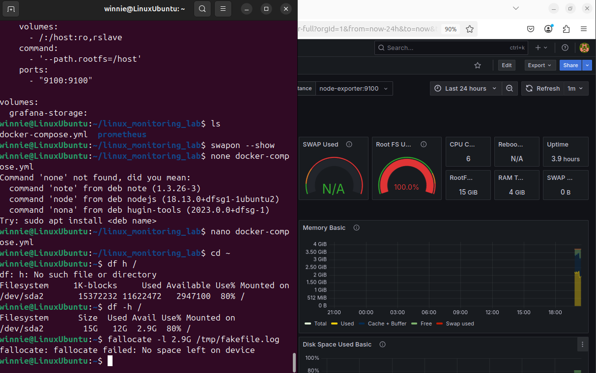
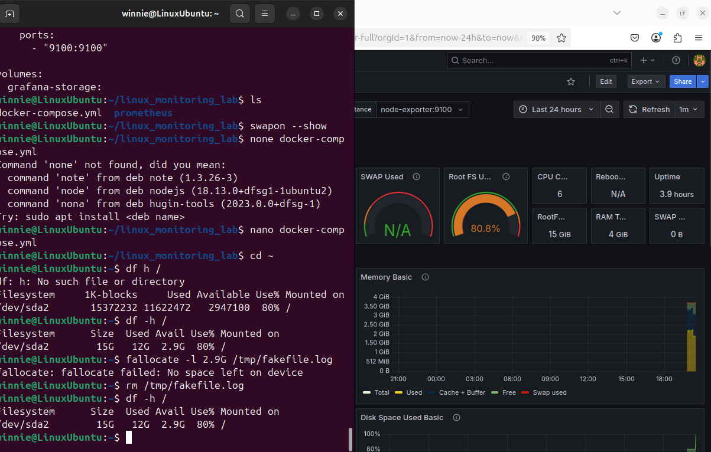
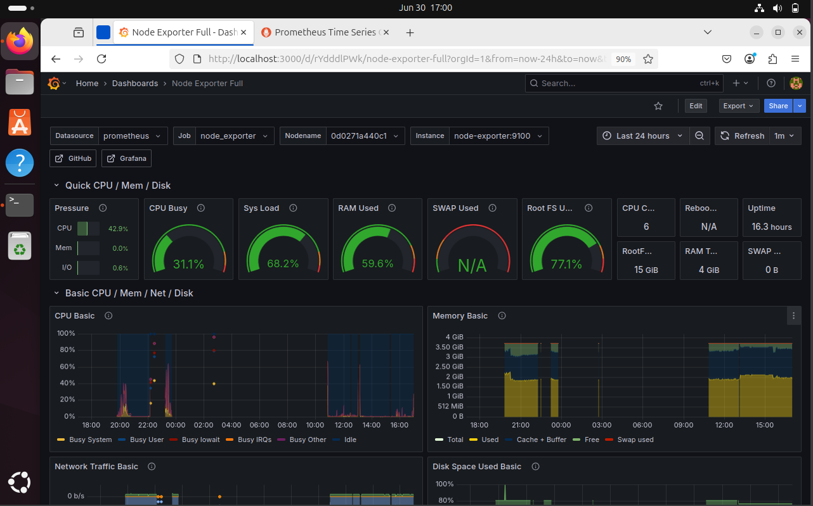
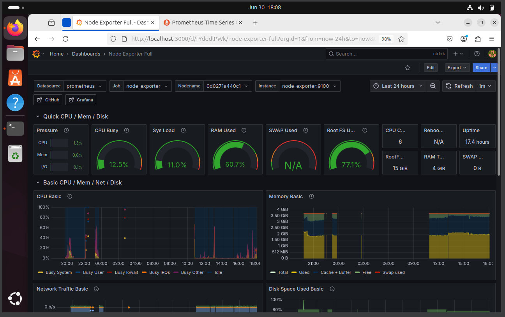

<p align="center">
  
</p>

# Linux Lab: Incident and Monitoring Simulations

This is a personal lab project created to practice Linux commands, simulate common failures, system monitoring, and understand how logs, incidents and containers work. It includes hands-on simulations using Docker, NGINX, Prometheus, and Grafana, all running on a Linux virtual machine.
⭐ Feel free to explore the repository, leave feedback or suggestions!

## Tools used

- Ubuntu Server 24.04.2 (on VM)
- Docker
- NGINX
- Terminal (Bash)
- Grafana
- Prometheus

## Simulations performed

- [Disk space full](#disk-space-full)
- [502 Bad Gateway with NGINX reverse proxy](#502-bad-gateway-with-nginx-reverse-proxy)
- [Root filesystem usage at 100%](#root-filesystem-usage-at-100-memory-overload)
- [CPU stress test](#cpu-stress-test)

---

### Disk space full

```bash
sudo dd if=/dev/zero of=~/bigfile bs=1M count=512
df -h
rm ~/bigfile
```

After running the dd command, the available disk space decreased as expected.


---

### 502 Bad Gateway with NGINX reverse proxy

To simulate a **502 Bad Gateway**, a custom NGINX configuration was used to forward requests to a backend on port `3000`, which was intentionally left offline.

#### Configuration file (`default.conf`):

```nginx
server {
    listen 80;

    location / {
        proxy_pass http://localhost:3000;
    }
}
```

Docker command used:

```bash
docker run --name nginx-502-test -d \
  -p 8080:80 \
  -v $(pwd)/default.conf:/etc/nginx/conf.d/default.conf \
  nginx
```

Access:
Open in your browser: http://localhost:8080

Result:
Because there was nothing running on port 3000, NGINX couldn’t connect and showed a 502 Bad Gateway error.


#### Cleaning up
To stop and remove the container after testing:
```bash
docker stop nginx-502-test
docker rm nginx-502-test
rm default.conf
```

---

### Root filesystem usage at 100% (Memory overload)

To simulate a high disk usage alert from Node Exporter and Prometheus: 
```bash
fallocate -l 2.9G /tmp/fakefile.log
df -h
```

After creating the file, disk usage on `/` increases drastically, triggering a "CRITICAL" alert in Grafana.



To fix the issue and restore available space:
```bash
rm /tmp/fakefile.log
df -h
```



---

### CPU stress test

The `stress` tool generates artificial CPU load by performing continuous computations, which helps observe how the system reacts under pressure.

### Stress command used:

```bash
sudo apt install stress
stress --cpu 1 --timeout 60
```

- This command uses 1 CPU core for 60 seconds to generate load.
- During the test, monitor the `CPU Busy`, `System Load`, and other metrics on Grafana.

While stress is running:



To stop the test manually (if needed):
```bash
pkill stress
```

After stopping the stress tool:



---

### Full `docker-compose.yml` used in this project

```yaml
services:
  prometheus:
    image: prom/prometheus
    volumes:
      - ./prometheus.yml:/etc/prometheus/prometheus.yml
    ports:
      - "9090:9090"

  grafana:
    image: grafana/grafana
    ports:
      - "3000:3000"
    volumes:
      - grafana-storage:/var/lib/grafana
    depends_on:
      - prometheus

  node-exporter:
    image: prom/node-exporter
    ports:
      - "9100:9100"
    volumes:
      - /:/host:ro,rslave
    command:
      - '--path.rootfs=/host'

volumes:
  grafana-storage:
```

---

### What's next?

More simulations will be added soon, including:
- Network errors
- High memory usage
- Log monitoring scenarios

Stay tuned 🚧
