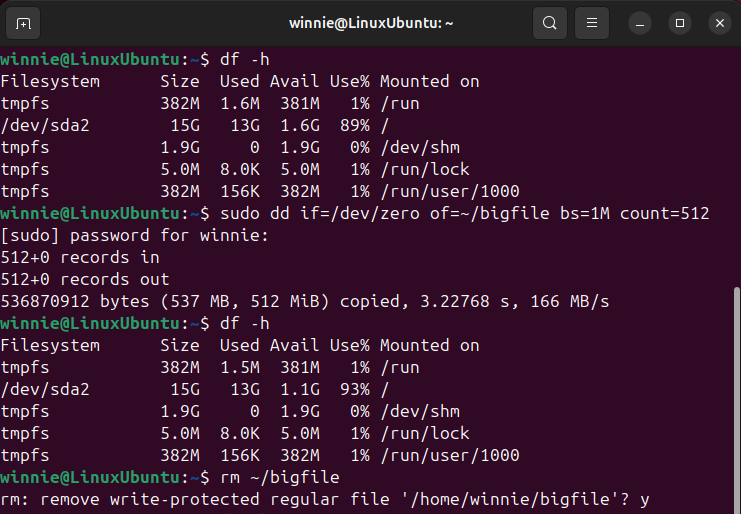
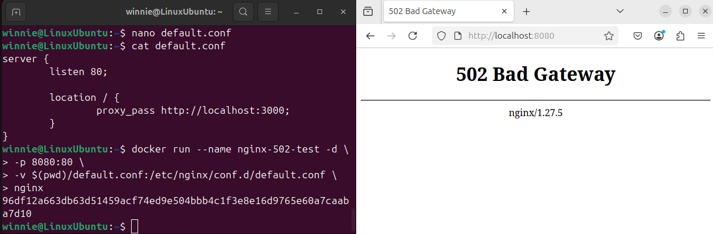

# Project: Linux Lab with Incident Simulations

This is a personal lab project created to practice Linux commands, simulate common failures, and understand how logs, incidents, and containers work.

## Tools used
- Ubuntu Server 24.04.2 (on VM)
- Docker
- NGINX
- Terminal (Bash)

## Simulations performed

- [Disk space full](#disk-space-full)
- [502 Bad Gateway with NGINX reverse proxy](#502-bad-gateway-with-nginx-reverse-proxy)

---

### Disk space full

```bash
sudo dd if=/dev/zero of=~/bigfile bs=1M count=512
df -h
rm ~/bigfile
```

After running the dd command, the available disk space decreased as expected.



### 502 Bad Gateway with NGINX reverse proxy

To simulate a **502 Bad Gateway**, a custom NGINX configuration was used to forward requests to a backend on port `3000`, which was intentionally left offline.

#### Configuration file (`default.conf`):

```nginx
server {
    listen 80;

    location / {
        proxy_pass http://localhost:3000;
    }
}
```

Docker command used:

```bash
docker run --name nginx-502-test -d \
  -p 8080:80 \
  -v $(pwd)/default.conf:/etc/nginx/conf.d/default.conf \
  nginx
```

Access:
Open in your browser: http://localhost:8080

Result:
Because there was nothing running on port 3000, NGINX couldn’t connect and showed a 502 Bad Gateway error.



#### Cleaning up
To stop and remove the container after testing:
```bash
docker stop nginx-502-test
docker rm nginx-502-test
```

If you also want to delete the custom configuration file:
```bash
rm default.conf
```
